# Jetpack Compose Samples


## Contents
- [What is Jetpack Compose?](#what-is-jetpack-compose)
- [Advantages of Jetpack Compose](#advantages-of-jetpack-compose)
- [Composable function](#composable-function)
- [State management in Compose](#state-management-in-compose)
- [Jetpack Compose Preview](#jetpack-compose-preview)
- [Rows](#rows)
- [Columns](#columns)
- [Box](#box)
- [Compose Modifiers](#compose-modifiers)
- [Text](#text)
- [Button](#buttons)
- [Image](#image)
- [TextField](#textfield)
- [Lazy Grids](#lazy-grids)
- [Lazy Lists](#lazy-lists)
- [Scaffold](#scaffold) (topAppBar, floatingActionButton, bottomBar)
- [Card](#card)
- [Progress Indicators](#progress-indicators)
- [Alert Dialog](#alert-dialog)
- [Custom Dialog](#custom-dialog)
- [DatePicker Dialog](#datepicker-dialog)
- [BottomSheet](#bottomsheet)
- [RadioButton](#radiobutton)
- [CheckBox](#checkbox)
- [Slider](#slider)
- [Switch](#switch)
- [Chips](#chips)
- [Tabs](#tabs)
- [BottomBar](#bottombar)
- [Dynamic themes](#dynamic-themes)
- [Switching between dark and light mode](#switching-between-dark-mode-and-light-mode)
- [Navigation in Compose](#navigation-in-compose)

### What is Jetpack Compose?
Jetpack Compose is Android’s **recommended** modern toolkit for building native UI. It simplifies and accelerates UI development on Android. Jetpack Compose is _declarative programming_, which means you can describe your user interface by invoking a set of composables, which is vastly different from the traditional way of imperative UI design.

### Advantages of Jetpack Compose
- Compose uses a declarative API, which means that all you need to do is describe your UI - Compose takes care of the rest. The APIs are intuitive - easy to discover and use.
- Compose is compatible with all your existing code: you can call Compose code from Views and Views from Compose.
- Compose allows you to do more with less code, compared to using the Android View system.
- With Composable functions, state can be handled reactively. When the state changes, only the parts of the UI that depend on this state are automatically and efficiently re-rendered. This is achieved through the use of state holders and observable state variables, which triggers the recomposition of the Composable functions they are used in.

### Composable function
A composable function is a modern way of developing UI in Android. It is a Kotlin function that is annotated with `@Composable`. This annotation tells the Compose compiler that the functions is meant for UI construction. Unlike tradition XML layouts in Android, Composable functions allow us to build UI with Kotlin code which is more intuitive and flexible. Composable functions can only be called from within the scope of other composable functions. We should think of composable functions to be similar to lego blocks - each composable function is in turn built up of smaller composable functions.
```
@Composable
fun HelloWorld(name: String) {
    Text(text = "Hello, $name!")
}
```

### State management in Compose
With Composable functions, state can be handled reactively. When the state changes, only the parts of the UI that depend on this state are automatically and efficiently re-rendered. This is achieved through the use of state holders and observable state variables, which triggers the recomposition of the Composable functions they are used in. Compose provides `State` (read-only) and `MutableState` (read-write).

There are two main ways to manage state in Jetpack Compose.
1. Stateful composables** are composables that manage their own state. This state is typically stored within the composable function itself, using tools provided by Jetpack Compose, such as `remember` or `mutableStateOf`. When the state changes, the composable recomposes itself, updating the UI with the new state.

```
var darkTheme by remember { mutableStateOf(false) }
```
2. **Stateless composables** are those that do not manage their own state internally. Instead, they receive their state through parameters and emit events to notify the parent composable of any changes. In the below example, the `SimpleButton` composable is stateless. It receives the text and onClick event through its parameters and does not manage any state.

```
@Composable
fun StatelessScreen() {
    val text = "Click me!"
    SimpleButton(text = text) { /* Handle click event */ }
}
```

### Jetpack Compose Preview
Compose comes with this nifty feature that lets you preview each component in the IntelliJ IDE itself, instead of needing to download the app to an Android device or emulator. To do so, we need to define `@Preview` to any of the `@Composable` methods and click on the preview button in the top right corner. The main restriction is, the composable function must not take any parameters. If your composable function requires a parameter, you can simply wrap your component inside another composable function that doesn't take any parameters and call your composable function with the appropriate params.


### Rows
A `Row` is a horizontal layout component in Jetpack Compose. It is used to position UI elements horizontally. You can add any number of children to a row, and they will be laid out horizontally in the order they were added. By default, the row will take up as much horizontal space as possible, and the children will be sized to fit within the row’s boundaries.

| Example                                                                        | Preview                                                                                       |
|--------------------------------------------------------------------------------|-----------------------------------------------------------------------------------------------|
| [RowScreen](app/src/main/java/com/an/jetpackcomposesample/screen/RowScreen.kt) |  |

```
@Composable
private fun RowStyle() {
    Row(
        modifier = Modifier
            // will set the min and max width of the composble to the maximum allowed by the container
            .fillMaxWidth()
            .padding(12.dp)
            .background(MaterialTheme.colorScheme.inverseOnSurface, shape = RoundedCornerShape(10.dp)),
        // The horizontalArrangement parameter controls the way free space is distributed between items.
        horizontalArrangement = Arrangement.Start)
{
        Text(text = "A")
        Text(text = "B")
        Text(text = "C")
    }
}
```

### Columns
A column is a vertical layout component in Jetpack Compose. It is used to position UI elements vertically. You can add any number of children to a column, and they will be laid out vertically in the order they were added. By default, the column will take up as much vertical space as possible, and the children will be sized to fit within the column’s boundaries.

| Example                                                                              | Preview                                                                                                   |
|--------------------------------------------------------------------------------------|-----------------------------------------------------------------------------------------------------------|
| [ColumnScreen](app/src/main/java/com/an/jetpackcomposesample/screen/ColumnScreen.kt) | 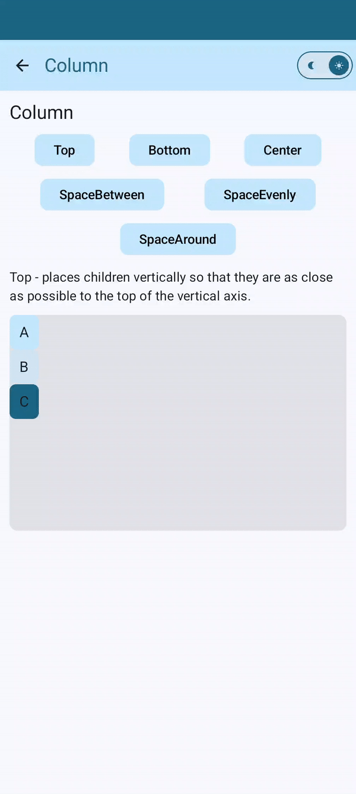 |

```
@Composable
private fun ColumnStyle() {
    Column(modifier = Modifier
        .fillMaxHeight(0.5f)
        .fillMaxWidth()
        .padding(12.dp)
        .alpha(1f)
        .background(MaterialTheme.colorScheme.inverseOnSurface, shape = RoundedCornerShape(10.dp)),
        verticalArrangement = arrangement
    ) {
        Text(text = "A")
        Text(text = "B")
        Text(text = "C")
    }
}
```

### Box
A box is a layout component that allows you to position a single UI element anywhere within its boundaries. You can add any UI element to a box and position it by specifying its alignment within the box.
```
Box(
   modifier = Modifier.size(size),
   contentAlignment = Alignment.Center
) {
    Text("Center", Modifier.align(Alignment.Center))
    Text("Top Start", Modifier.align(Alignment.TopStart))
    Text("Top End", Modifier.align(Alignment.TopEnd))
    Text("Bottom Start", Modifier.align(Alignment.BottomStart))
    Text("Bottom End", Modifier.align(Alignment.BottomEnd))
 }
```

### Compose Modifiers
Modifier elements decorate or add behavior to Compose UI elements. For example, backgrounds, padding and click event listeners decorate or add behavior to rows, text or buttons. Modifiers are standard Kotlin objects. We can create a modifier by calling one of the `Modifier` class functions.
```
Text("Text with green background color",
    modifier = Modifier
                .background(color = Color.Green)) // background color
                .padding(16.dp) // inner padding
                .width(200.dp) // define width & height separately
                .height(300.dp)
                .size(width = 250.dp, height = 100.dp) // OR add size
                .alpha(0.5f) // 50% opacity
                .rotate(45f) // Sets the degrees the view is rotated around the center of the composable.
                .scale(scaleX = 2f, scaleY = 3f) // Scale the contents of the composable by the following scale factors along the horizontal and vertical axis respectively.
                .weight(1f) // you can specify a size ratio between multiple views
                .border(2.dp,Color.Red) // adds border to the text
                .clip(RoundedCornerShape(25.dp)) // allows you to clip the existing shape
```

### Text
`Text` is a central piece of any UI, and Jetpack Compose makes it easier to display or write text. Attributes of the `Text` composable include:
```
@Composable
fun Text(
    text: String,                                        // the text to be displayed
    modifier: Modifier = Modifier,                       // the Modifier to be applied to this layout node
    color: Color = Color.Unspecified,                    // Color to apply to the text
    fontSize: TextUnit = TextUnit.Unspecified,           // the size of glyphs to use when painting the text
    fontStyle: FontStyle? = null,                        // the typeface variant to use when drawing the letters (e.g., italic)
    fontWeight: FontWeight? = null,                      // the typeface thickness to use when painting the text
    fontFamily: FontFamily? = null,                      // the font family to be used when rendering the text
    letterSpacing: TextUnit = TextUnit.Unspecified,      // the amount of space to add between each letter
    textDecoration: TextDecoration? = null,              // the decorations to paint on the text (e.g., an underline)  
    textAlign: TextAlign? = null,                        // the alignment of the text within the lines of the paragraph
    lineHeight: TextUnit = TextUnit.Unspecified,         // line height for the Paragraph in TextUnit unit
    overflow: TextOverflow = TextOverflow.Clip,          // defines how visual overflow should be handled.  
    softWrap: Boolean = true,                            // whether the text should break at soft line breaks.
    maxLines: Int = Int.MAX_VALUE,                       // An optional maximum number of lines for the text to span, wrapping if necessary 
    minLines: Int = 1,                                   // The minimum height in terms of minimum number of visible lines.  
    onTextLayout: ((TextLayoutResult) -> Unit)? = null,  // callback that is executed when a new text layout is calculated.   
    style: TextStyle = LocalTextStyle.current            // style configuration for the text such as color, font, line height etc.
)
```
| Example                                                                              | Preview                                                                                                   |
|--------------------------------------------------------------------------------------|-----------------------------------------------------------------------------------------------------------|
| [TextScreen](app/src/main/java/com/an/jetpackcomposesample/screen/TextScreen.kt) |  |

### Buttons
Buttons are fundamental components that allow the user to trigger a defined action. In Jetpack Compose, you need to give two arguments for buttons. The first argument as `onClick` callback and another one is your button `text` element. You can add a `Text`-Composable or any other Composable as child elements of the Button. There are five types of buttons.

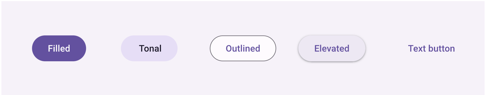
*[Reference](https://developer.android.com/develop/ui/compose/components/button)*

```
@Composable
fun Button(
    onClick: () -> Unit,                                              // called when this button is clicked
    modifier: Modifier = Modifier,                                    // the [Modifier] to be applied to this button  
    enabled: Boolean = true,                                          // controls the enabled state of this button.
    shape: Shape = ButtonDefaults.shape,                              // defines the shape of this button's container, border (when [border] is not null), and shadow (when using [elevation])
    colors: ButtonColors = ButtonDefaults.buttonColors(),             // used to resolve the colors for this button in different states
    elevation: ButtonElevation? = ButtonDefaults.buttonElevation(),   // used to resolve the elevation for this button in different states. This controls the size of the shadow below the button.
    border: BorderStroke? = null,                                    // the border to draw around the container of this button
    contentPadding: PaddingValues = ButtonDefaults.ContentPadding,   // the spacing values to apply internally between the container and the content
    interactionSource: MutableInteractionSource = remember { MutableInteractionSource() }, 
    content: @Composable RowScope.() -> Unit
) {
    // Content of the Button
    Text(text = "Clicked me!")
}
```
| Example                                                                              | Preview                                                                                                   |
|--------------------------------------------------------------------------------------|-----------------------------------------------------------------------------------------------------------|
| [ButtonScreen](app/src/main/java/com/an/jetpackcomposesample/screen/ButtonScreen.kt) | 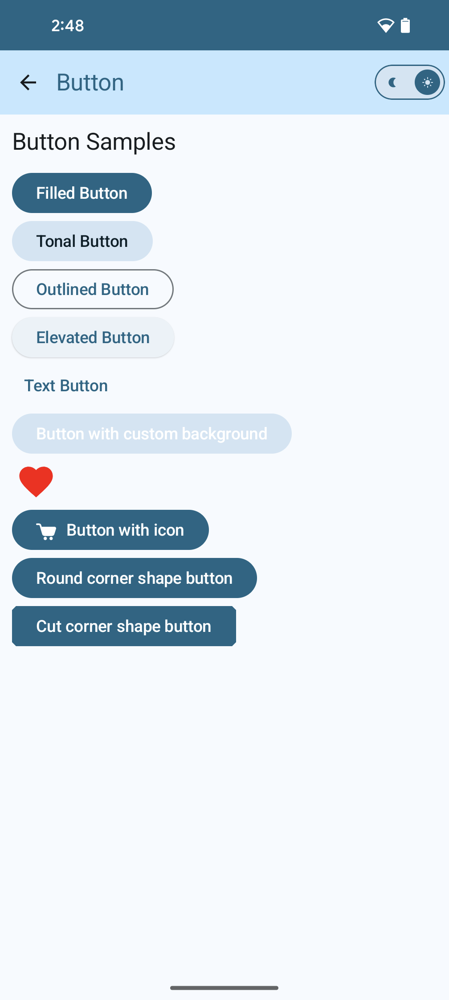 |

### Image
We can use the `Image` composable to display a graphic on screen. The different attributes of `Image` are:
```
@Composable
fun Image(
    painter: Painter,     // loads a drawable from resources. Use painterResource and pass a resource id
    contentDescription: String?, // to give description about the image
    modifier: Modifier = Modifier, // defines the modifier for the image
    alignment: Alignment = Alignment.Center,
    contentScale: ContentScale = ContentScale.Fit,
    alpha: Float = DefaultAlpha,
    colorFilter: ColorFilter? = null
)

// Example
@Composable
fun SimpleImageExample() {
    // Image is a pre-defined composable that lays out and draws a given [ImageBitmap]
    Image(
        painter = painterResource(id = R.drawable.ic_image),
        contentDescription = stringResource(id = R.string.image_screen_content_desc),
        modifier = Modifier
            .padding(10.dp)
            .size(120.dp)
    )
}
```

| Example                                                                            | Preview                                                                                               |
|------------------------------------------------------------------------------------|-------------------------------------------------------------------------------------------------------|
| [ImageScreen](app/src/main/java/com/an/jetpackcomposesample/screen/ImageScreen.kt) | 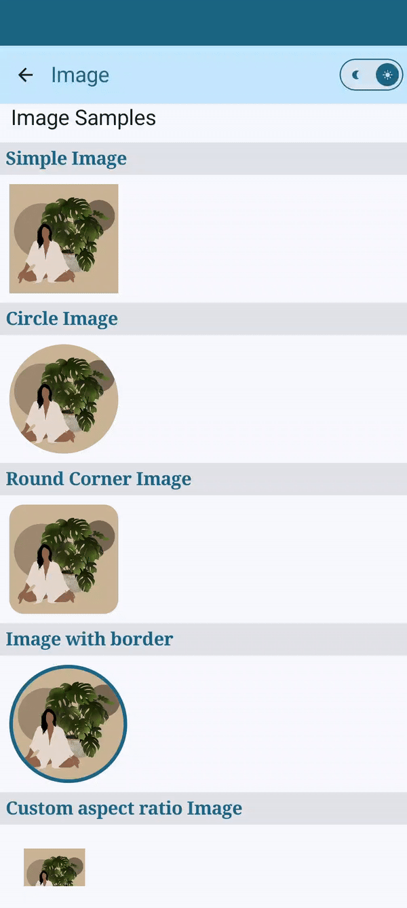 |

### TextField
`TextField` allows users to enter and modify text. The different attributes of `TextField` are:
```
@Composable
fun TextField(
    value: TextFieldValue,                      // the input value to be shown in the text field
    onValueChange: (TextFieldValue) -> Unit,    // the callback that is triggered when user enters any value
    modifier: Modifier = Modifier,              // defines the modifier for the TextField
    enabled: Boolean = true,                    // controls the enabled state of this text field
    readOnly: Boolean = false,                  // controls the editable state of the text field
    textStyle: TextStyle = LocalTextStyle.current,      // the style to be applied to the input text.
    label: @Composable (() -> Unit)? = null,            // the optional label to be displayed inside the text field container.
    placeholder: @Composable (() -> Unit)? = null,      // the optional placeholder to be displayed when the text field is empty
    leadingIcon: @Composable (() -> Unit)? = null,      // the optional leading icon to be displayed at the beginning of the text field container
    trailingIcon: @Composable (() -> Unit)? = null,     // the optional trailing icon to be displayed at the end of the text field container
    prefix: @Composable (() -> Unit)? = null,           // the optional prefix to be displayed before the input text in the text field
    suffix: @Composable (() -> Unit)? = null,           // the optional suffix to be displayed after the input text in the text field
    supportingText: @Composable (() -> Unit)? = null,   // the optional supporting text to be displayed below the text field
    isError: Boolean = false,                                       // indicates if the text field's current value is in error state.
    visualTransformation: VisualTransformation = VisualTransformation.None,             // transforms the visual representation of the input value
    keyboardOptions: KeyboardOptions = KeyboardOptions.Default,                         // software keyboard options that contains configuration such as KeyboardType and ImeAction
    keyboardActions: KeyboardActions = KeyboardActions.Default,                         // when the input service emits an IME action, the corresponding callback is called.
    singleLine: Boolean = false,                                    // this text field becomes a single horizontally scrolling text field instead of wrapping onto multiple lines.
    maxLines: Int = if (singleLine) 1 else Int.MAX_VALUE,           // the maximum height in terms of maximum number of visible lines
    minLines: Int = 1,                                              // the minimum height in terms of minimum number of visible lines
    interactionSource: MutableInteractionSource = remember { MutableInteractionSource() },     
    shape: Shape = TextFieldDefaults.shape,                         // defines the shape of this text field's container
    colors: TextFieldColors = TextFieldDefaults.colors()            // [TextFieldColors] that will be used to resolve the colors used for this text field in different states.
)

// Example
TextField(
    value = password,
    onValueChange = { password = it },
    label = { Text("Enter password") },
    visualTransformation = PasswordVisualTransformation(),
    keyboardOptions = KeyboardOptions(
    keyboardType = KeyboardType.Password,
    imeAction = ImeAction.Done
    )
) 
```

| Example                                                                                    | Preview                                                                                                               |
|--------------------------------------------------------------------------------------------|-----------------------------------------------------------------------------------------------------------------------|
| [TextFieldScreen](app/src/main/java/com/an/jetpackcomposesample/screen/TextFieldScreen.kt) | 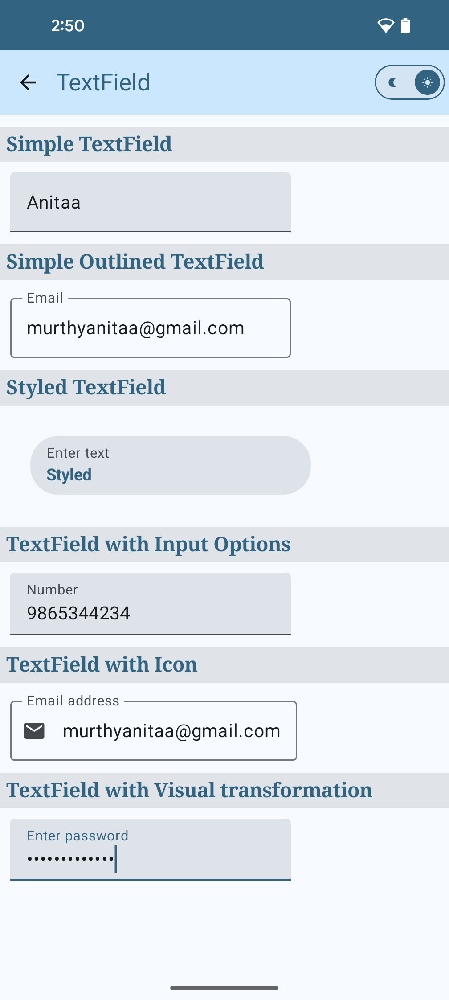 |

### Lazy Grids
Vertical staggered grid layout that composes and lays out only items currently visible on screen. Attributes of `Grid` include:
```
@Composable
fun LazyVerticalStaggeredGrid(
    columns: StaggeredGridCells,                                        // description of the size and number of staggered grid columns.
    modifier: Modifier = Modifier,                                      // modifier to apply to the layout.
    state: LazyStaggeredGridState = rememberLazyStaggeredGridState(),   // state object that can be used to control and observe staggered grid state.
    contentPadding: PaddingValues = PaddingValues(0.dp),                // padding around the content.
    reverseLayout: Boolean = false,                                     // reverse the direction of scrolling and layout. When `true`, items are laid out in the reverse order
    verticalItemSpacing: Dp = 0.dp,                                     // vertical spacing between items    
    horizontalArrangement: Arrangement.Horizontal = Arrangement.spacedBy(0.dp),         // arrangement specifying horizontal spacing between items.
    flingBehavior: FlingBehavior = ScrollableDefaults.flingBehavior(),                  // logic responsible for handling fling.
    userScrollEnabled: Boolean = true,                                  // whether scroll with gestures or accessibility actions are allowed.
    content: LazyStaggeredGridScope.() -> Unit                          // a lambda describing the staggered grid content. Inside this block you can use [LazyStaggeredGridScope.items] to present list of items
)

// Example
LazyVerticalStaggeredGrid(
    columns = StaggeredGridCells.Adaptive(minSize = 180.dp),
    // applied to outside edges of our content – creating some visual space between the edges of the content and the container
    // contentPadding = PaddingValues(16.dp),
    // horizontalArrangement = Arrangement.spacedBy(16.dp)
    ) {
        val gridList = (1..20).map {
            GridModel(it, getRandomColor(), getRandomHeight(), getRandomIcon())
        }
        items(gridList.size) {
            GridItem(modifier, gridList[it])
        }
 }
```

| Example                                                                               | Preview                                                                                           |
|---------------------------------------------------------------------------------------|---------------------------------------------------------------------------------------------------|
| [GridScreen](app/src/main/java/com/an/jetpackcomposesample/screen/grid/GridScreen.kt) | 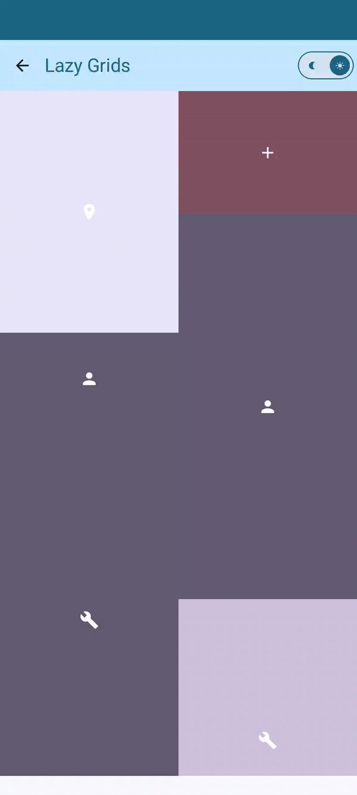 |

### Lazy Lists
Compose provides a set of components which only compose and lay out items which are visible in the component’s viewport. These components include `LazyColumn` (Vertical `RecyclerView`) and `LazyRow` (Horizontal `RecyclerView`). In LazyColumn you can add an `item()` or `items()`.
```
@Composable
fun LazyColumn(
    modifier: Modifier = Modifier,                                          // the modifier to apply to this layout.
    state: LazyListState = rememberLazyListState(),                         // the state object to be used to control or observe the list's state.
    contentPadding: PaddingValues = PaddingValues(0.dp),                    // a padding around the whole content.
    reverseLayout: Boolean = false,                                         // reverse the direction of scrolling and layout.
    verticalArrangement: Arrangement.Vertical =
        if (!reverseLayout) Arrangement.Top else Arrangement.Bottom,        // The vertical arrangement of the layout's children. This allows to add a spacing between items and specify the arrangement of the items when we have not enough of them to fill the whole minimum size.
    horizontalAlignment: Alignment.Horizontal = Alignment.Start,            // the horizontal alignment applied to the items.
    flingBehavior: FlingBehavior = ScrollableDefaults.flingBehavior(),      // logic describing fling behavior.
    userScrollEnabled: Boolean = true,                                      // whether the scrolling via the user gestures or accessibility actions is allowed. 
    content: LazyListScope.() -> Unit                                       // a block which describes the content 
)

// Example
LazyColumn(
     contentPadding = PaddingValues(16.dp),
     verticalArrangement = Arrangement.spacedBy(6.dp),
     modifier = modifier.fillMaxSize().wrapContentHeight()
) {
        // items is a DSL available in the LazyColumn scope. This allows you to render a composable
        // for a single element in the list.
        items(list.size) {
            ListItem(item = list[it], onClick = { listModel ->
                Toast.makeText(context, listModel.name +  " clicked!", Toast.LENGTH_SHORT).show()
            })
        }
}
```

| Example                                                                               | Preview                                                                                           |
|---------------------------------------------------------------------------------------|---------------------------------------------------------------------------------------------------|
| [ListScreen](app/src/main/java/com/an/jetpackcomposesample/screen/list/ListScreen.kt) | 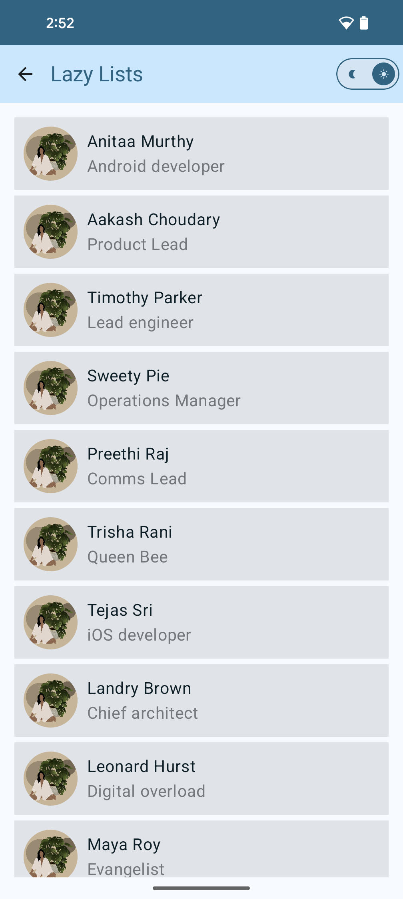 |

### Scaffold
The `Scaffold` composable provides a straightforward API you can use to quickly assemble your app's structure according to Material Design guidelines. `Scaffold` accepts several composables as parameters.
```
@Composable
fun Scaffold(
    modifier: Modifier = Modifier,                              // the modifier to apply to this layout. 
    topBar: @Composable () -> Unit = {},                        // top app bar of the screen
    bottomBar: @Composable () -> Unit = {},                     // bottom bar of the screen
    snackbarHost: @Composable () -> Unit = {},                  // component to host Snackbars that are pushed to be shown via SnackbarHostState.showSnackbar
    floatingActionButton: @Composable () -> Unit = {},              // Main action button of the screen
    floatingActionButtonPosition: FabPosition = FabPosition.End,        // position of the FAB on the screen
    containerColor: Color = MaterialTheme.colorScheme.background,       // the color used for the background of this scaffold.
    contentColor: Color = contentColorFor(containerColor),              // the preferred color for content inside this scaffold.
    contentWindowInsets: WindowInsets = ScaffoldDefaults.contentWindowInsets,       // window insets to be passed to content slot via PaddingValues params.
    content: @Composable (PaddingValues) -> Unit                // content of the screen
)
    
// Example
Scaffold(
        bottomBar = {
            BottomAppBar(
                containerColor = MaterialTheme.colorScheme.primaryContainer,
                contentColor = MaterialTheme.colorScheme.primary,
            ) {
                Text(
                    modifier = Modifier.fillMaxWidth(),
                    textAlign = TextAlign.Center,
                    text = "Bottom app bar",
                )
            }
        },
        floatingActionButton = {
            FloatingActionButton(
                containerColor = MaterialTheme.colorScheme.primaryContainer,
                contentColor = MaterialTheme.colorScheme.primary,
                onClick = { Toast.makeText(context, "Clicked!", Toast.LENGTH_SHORT).show() }
            ) {
                Icon(Icons.Default.Add, contentDescription = "Add")
            }
        }
)    
```

| Example                                                                                  | Preview                                                                                                           |
|------------------------------------------------------------------------------------------|-------------------------------------------------------------------------------------------------------------------|
| [ScaffoldScreen](app/src/main/java/com/an/jetpackcomposesample/screen/ScaffoldScreen.kt) | 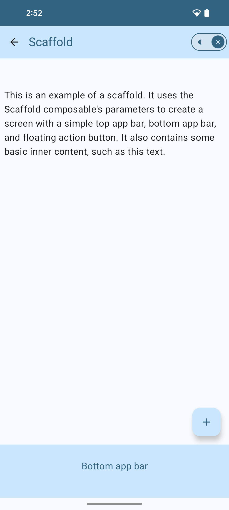 |


### Card
`Card` composable is a predefined composable that is meant to represent the card surface as specified by the Material Design specification. We also configure it to have rounded corners and apply a modifier. Attributes of `Card` composable includes:
```
@Composable
fun Card(
    modifier: Modifier = Modifier,                    // the Modifier to be applied to this card
    shape: Shape = CardDefaults.shape,                // defines the shape of this card's container, border (when border is not null), and shadow (when using elevation)
    colors: CardColors = CardDefaults.cardColors(),    //  CardColors that will be used to resolve the colors used for this card in different states.
    elevation: CardElevation = CardDefaults.cardElevation(),        // This controls the size of the shadow below the card.
    border: BorderStroke? = null,                      // the border to draw around the container of this card  
    content: @Composable ColumnScope.() -> Unit        // define content of the card
)

// Example
Card(
    elevation = CardDefaults.cardElevation(8.dp),
    modifier = paddingModifier
            .fillMaxWidth()
            .height(120.dp)
    ) {
        Text(text = "Simple Card ",
            modifier = paddingModifier)
    }
}
```

| Example                                                                          | Preview                                                                                           |
|----------------------------------------------------------------------------------|---------------------------------------------------------------------------------------------------|
| [CardScreen](app/src/main/java/com/an/jetpackcomposesample/screen/CardScreen.kt) | 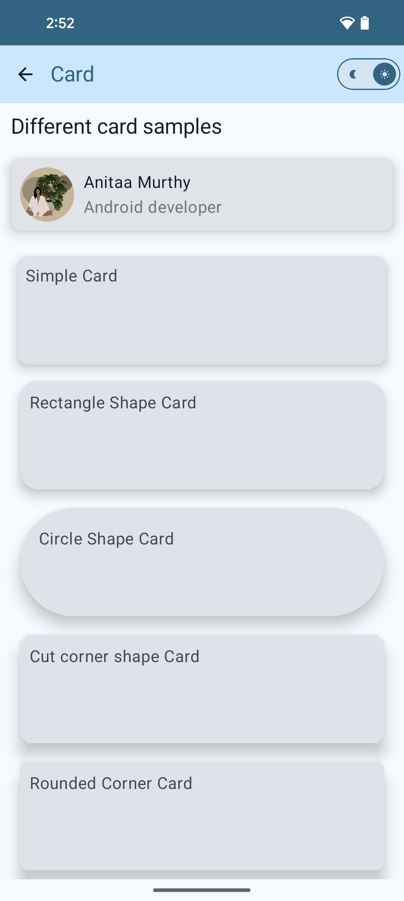 |

### Progress Indicators
Progress indicators visually surface the status of an operation. They use motion to bring to the user's attention how near completion the process is, such as loading or processing data. There are 2 types of Progress indicators: `LinearProgressIndicator` & `CircularProgressIndicator`. Attributes of `LinearProgressIndicator` includes:
```
@Composable
fun LinearProgressIndicator(
    modifier: Modifier = Modifier,                                         // the Modifier to be applied to this progress indicator
    color: Color = ProgressIndicatorDefaults.linearColor,                 // color of this progress indicator 
    trackColor: Color = ProgressIndicatorDefaults.linearTrackColor,        // color of the track behind the indicator, visible when the progress has not reached the area of the overall indicator yet
    strokeCap: StrokeCap = ProgressIndicatorDefaults.LinearStrokeCap,      // stroke cap to use for the ends of this progress indicator
)

// Example of LinearProgressIndicator
LinearProgressIndicator(
        modifier = Modifier.fillMaxWidth().height(8.dp),
        trackColor = MaterialTheme.colorScheme.secondaryContainer,
        color = MaterialTheme.colorScheme.primary, //progress color
    )
}

// Example of CircularProgressIndicator
CircularProgressIndicator(
        trackColor = MaterialTheme.colorScheme.primary,
        color = MaterialTheme.colorScheme.secondaryContainer //progress color
)
```

| Example                                                                                        | Preview                                                                                                           |
|------------------------------------------------------------------------------------------------|-------------------------------------------------------------------------------------------------------------------|
| [ProgressBarScreen](app/src/main/java/com/an/jetpackcomposesample/screen/ProgressBarScreen.kt) | 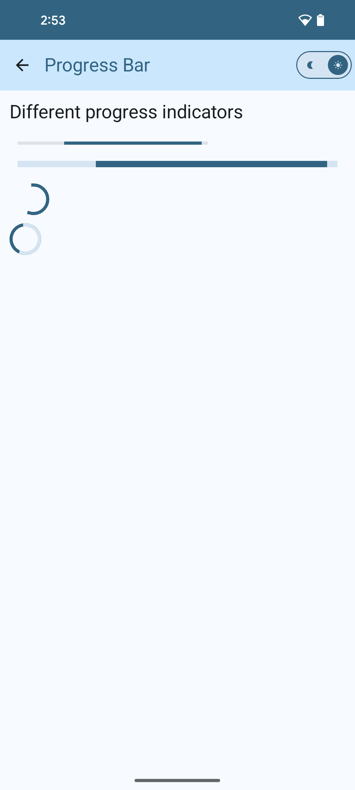 |

### Alert Dialog
The `AlertDialog` composable provides a convenient API for creating a Material Design themed dialog. `AlertDialog` has specific parameters for handling particular elements of the dialog.
```
@Composable
fun AlertDialog(
    onDismissRequest: () -> Unit,               // called when the user tries to dismiss the Dialog by clicking outside or pressing the back button. This is not called when the dismiss button is clicked.
    confirmButton: @Composable () -> Unit,      // button which is meant to confirm a proposed action
    modifier: Modifier = Modifier,              // the Modifier to be applied to this dialog
    dismissButton: @Composable (() -> Unit)? = null,        // button which is meant to dismiss the dialog
    icon: @Composable (() -> Unit)? = null,     // optional icon that will appear above the title or above the text.
    title: @Composable (() -> Unit)? = null,    // title which should specify the purpose of the dialog.
    text: @Composable (() -> Unit)? = null,     // text which presents the details regarding the dialog's purpose.
    shape: Shape = AlertDialogDefaults.shape,   // defines the shape of this dialog's container
    containerColor: Color = AlertDialogDefaults.containerColor,         // the color used for the background of this dialog.
    iconContentColor: Color = AlertDialogDefaults.iconContentColor,     // the content color used for the icon.
    titleContentColor: Color = AlertDialogDefaults.titleContentColor,   // the content color used for the title.
    textContentColor: Color = AlertDialogDefaults.textContentColor,     // the content color used for the text.
    tonalElevation: Dp = AlertDialogDefaults.TonalElevation,            // when containerColor is ColorScheme.surface, a translucent primary color overlay is applied on top of the container.
    properties: DialogProperties = DialogProperties()               // typically platform specific properties to further configure the dialog.
)


// Example of AlertDialog
AlertDialog(
        icon = {
            Icon(Icons.Filled.Info, contentDescription = "Info Icon", tint = MaterialTheme.colorScheme.secondaryContainer)
        },
        title = {
            Text(text = "Dialog with info icon")
        },
        text = {
            Text(text = "The Dialog component displays pop up messages or requests user input on a layer above the main app content. It creates an interruptive UI experience to capture user attention.")
        },
        onDismissRequest = { },
        confirmButton = {
            TextButton(
                onClick = { showAlertDialog.value = false }
            ) {
                Text("Confirm", color = MaterialTheme.colorScheme.primary)
            }
        },
        dismissButton = {
            TextButton(
                onClick = { showAlertDialog.value = false }
            ) {
                Text("Dismiss", color = MaterialTheme.colorScheme.primary)
            }
        }
)
```

| Example                                                                              | Preview                                                                                                                         |
|--------------------------------------------------------------------------------------|---------------------------------------------------------------------------------------------------------------------------------|
| [DialogScreen](app/src/main/java/com/an/jetpackcomposesample/screen/DialogScreen.kt) | 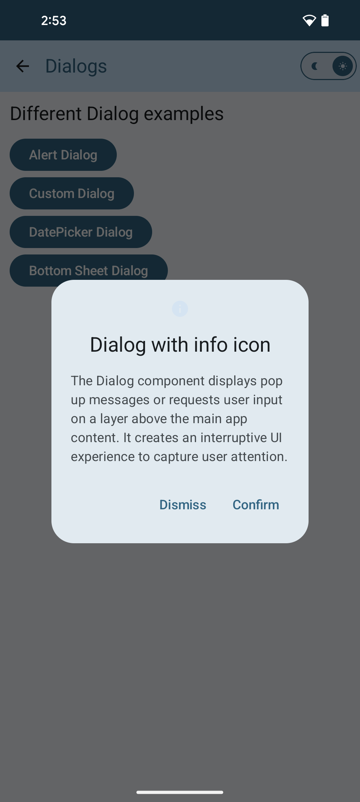 |

### Custom Dialog
`Dialog` is a basic composable that doesn't provide any styling or predefined slots for content. It is a relatively straightforward container that you should populate with a container such as `Card`.
```
@Composable
fun Dialog(
    onDismissRequest: () -> Unit,                       // Executes when the user tries to dismiss the dialog.
    properties: DialogProperties = DialogProperties(),  // for further customization of this dialog's behavior.
    content: @Composable () -> Unit                     // The content to be displayed inside the dialog.
)

// Example of Dialog
Dialog(onDismissRequest = { showCustomDialog.value = false }) {
    Card(
          elevation = CardDefaults.cardElevation(8.dp),
          shape = RoundedCornerShape(8.dp),
          modifier = Modifier
                .fillMaxWidth()
                .padding(bottom = 20.dp, top = 20.dp)
    ) {
         Column(
             horizontalAlignment = Alignment.CenterHorizontally,
             modifier = Modifier.fillMaxWidth().wrapContentHeight()
                    .background(MaterialTheme.colorScheme.inverseOnSurface)
                    .padding(16.dp)
            ) {
                Icon(Icons.Filled.Info, contentDescription = "Info Icon", tint = MaterialTheme.colorScheme.secondaryContainer)
                    Column(modifier = Modifier.padding(16.dp).fillMaxWidth(),
                        verticalArrangement = Arrangement.Center,
                        horizontalAlignment = Alignment.CenterHorizontally,
                ) {
                 Text(
                        text = "Dialog with info icon",
                        style = TextStyle(fontWeight = FontWeight.Bold, color = MaterialTheme.colorScheme.primary, fontSize = 18.sp)
                    )
                 Text(
                        modifier = Modifier.padding(top = 10.dp),
                        textAlign = TextAlign.Center,
                        text = "This Dialog is an example of a custom dialog with the Dialog Composable"
                    )
                }
                TextButton(
                    onClick = { showCustomDialog.value = false }
                ) {
                    Text("Confirm", color = MaterialTheme.colorScheme.primary)
                }
                TextButton(
                    onClick = { showCustomDialog.value = false }
                ) {
                    Text("Dismiss", color = MaterialTheme.colorScheme.primary)
                }
            }
     }
 }
```

| Example                                                                              | Preview                                                                                                                             |
|--------------------------------------------------------------------------------------|-------------------------------------------------------------------------------------------------------------------------------------|
| [DialogScreen](app/src/main/java/com/an/jetpackcomposesample/screen/DialogScreen.kt) | 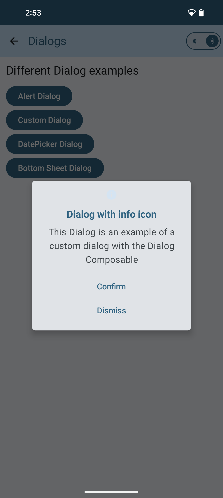 |

## DatePicker Dialog
The `DatePicker` composable is designed to display a full-screen view of the `DatePicker`. It offers a range of features, including date validation, which allows you to disable future dates or implement custom logic based on your requirements. To enable date validation, you’ll need to provide your own implementation of the SelectableDates interface. We can use the `DatePickerDialog` composable to create a wrapper around `DatePicker` where you can pass your own **Ok** button, **Cancel** button composables.

```
@Composable
fun DatePickerDialog(
    onDismissRequest: () -> Unit,
    confirmButton: @Composable () -> Unit,
    modifier: Modifier = Modifier,
    dismissButton: @Composable (() -> Unit)? = null,
    shape: Shape = DatePickerDefaults.shape,
    tonalElevation: Dp = DatePickerDefaults.TonalElevation,
    colors: DatePickerColors = DatePickerDefaults.colors(),
    properties: DialogProperties = DialogProperties(usePlatformDefaultWidth = false),
    content: @Composable ColumnScope.() -> Unit
)

// Example of DatePickerDialog
DatePickerDialog(
    onDismissRequest = { showDatePickerDialog.value = false },
    confirmButton = {
          TextButton(
                onClick = { showDatePickerDialog.value = false }
            ) {
                Text("Confirm", color = MaterialTheme.colorScheme.primary)
            }
    },
    dismissButton = {
          TextButton(
                onClick = { showDatePickerDialog.value = false }
          ) {
                Text(text = "Cancel", color = MaterialTheme.colorScheme.primary)
          }
    }) {
    DatePicker(
          state = dateState,
          showModeToggle = true
    )
}
```

| Example                                                                              | Preview                                                                                                                   |
|--------------------------------------------------------------------------------------|---------------------------------------------------------------------------------------------------------------------------|
| [DialogScreen](app/src/main/java/com/an/jetpackcomposesample/screen/DialogScreen.kt) | 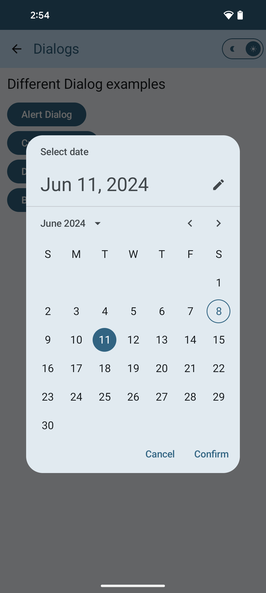 |

Credits
-----------------
Author: Anitaa Murthy (murthyanitaa@gmail.com)

<a href="https://medium.com/@anitaa_1990">
  
</a>
<a href="https://www.linkedin.com/in/anitaa1990">
  
</a>


License
-----------------

    Copyright 2024 Anitaa Murthy

    Licensed under the Apache License, Version 2.0 (the "License");
    you may not use this file except in compliance with the License.
    You may obtain a copy of the License at

       http://www.apache.org/licenses/LICENSE-2.0

    Unless required by applicable law or agreed to in writing, software
    distributed under the License is distributed on an "AS IS" BASIS,
    WITHOUT WARRANTIES OR CONDITIONS OF ANY KIND, either express or implied.
    See the License for the specific language governing permissions and
    limitations under the License.
