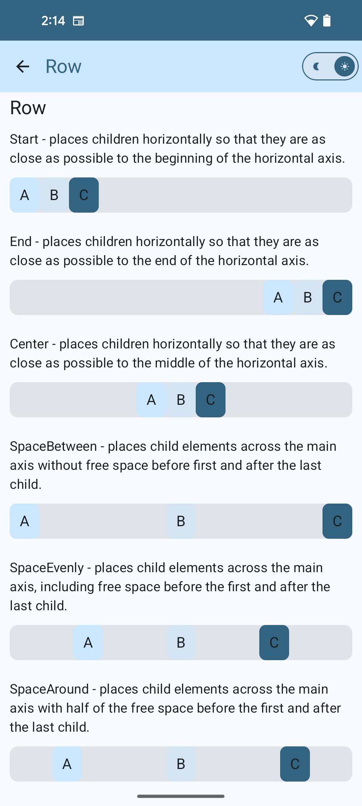

# Jetpack Compose Samples


## Contents
- [What is Jetpack Compose?](#what-is-jetpack-compose)
- [Advantages of Jetpack Compose](#advantages-of-jetpack-compose)
- [Composable function](#composable-function)
- [State management in Compose](#state-management-in-compose)
- [Jetpack Compose Preview](#jetpack-compose-preview)
- [Rows](#rows)
- [Columns](#columns)
- [Box](#box)
- [Compose Modifiers](#compose-modifiers)
- [Text](#text)
- [Button](#button)
- [Image](#image)
- [TextField](#textfield)
- [Lazy Grids](#lazy-grids)
- [Lazy Lists](#lazy-lists)
- [Scaffold](#scaffold) (topAppBar, floatingActionButton, bottomBar)
- [Card](#card)
- [Progress Indicators](#progress-indicators)
- [Alert Dialog](#alert-dialog)
- [Custom Dialog](#custom-dialog)
- [DatePicker Dialog](#datepicker-dialog)
- [BottomSheet](#bottomsheet)
- [RadioButton](#radiobutton)
- [CheckBox](#checkbox)
- [Slider](#slider)
- [Switch](#switch)
- [Chips](#chips)
- [Tabs](#tabs)
- [BottomBar](#bottombar)
- [Dynamic themes](#dynamic-themes)
- [Switching between dark and light mode](#switching-between-dark-mode-and-light-mode)
- [Navigation in Compose](#navigation-in-compose)

### What is Jetpack Compose?
Jetpack Compose is Android’s **recommended** modern toolkit for building native UI. It simplifies and accelerates UI development on Android. Jetpack Compose is _declarative programming_, which means you can describe your user interface by invoking a set of composables, which is vastly different from the traditional way of imperative UI design.

### Advantages of Jetpack Compose
- Compose uses a declarative API, which means that all you need to do is describe your UI - Compose takes care of the rest. The APIs are intuitive - easy to discover and use.
- Compose is compatible with all your existing code: you can call Compose code from Views and Views from Compose.
- Compose allows you to do more with less code, compared to using the Android View system.
- With Composable functions, state can be handled reactively. When the state changes, only the parts of the UI that depend on this state are automatically and efficiently re-rendered. This is achieved through the use of state holders and observable state variables, which triggers the recomposition of the Composable functions they are used in.

### Composable function
A composable function is a modern way of developing UI in Android. It is a Kotlin function that is annotated with `@Composable`. This annotation tells the Compose compiler that the functions is meant for UI construction. Unlike tradition XML layouts in Android, Composable functions allow us to build UI with Kotlin code which is more intuitive and flexible. Composable functions can only be called from within the scope of other composable functions. We should think of composable functions to be similar to lego blocks - each composable function is in turn built up of smaller composable functions.
```
@Composable
fun HelloWorld(name: String) {
    Text(text = "Hello, $name!")
}
```

### State management in Compose
With Composable functions, state can be handled reactively. When the state changes, only the parts of the UI that depend on this state are automatically and efficiently re-rendered. This is achieved through the use of state holders and observable state variables, which triggers the recomposition of the Composable functions they are used in. Compose provides `State` (read-only) and `MutableState` (read-write).

There are two main ways to manage state in Jetpack Compose.
1. Stateful composables** are composables that manage their own state. This state is typically stored within the composable function itself, using tools provided by Jetpack Compose, such as `remember` or `mutableStateOf`. When the state changes, the composable recomposes itself, updating the UI with the new state.

```
var darkTheme by remember { mutableStateOf(false) }
```
2. **Stateless composables** are those that do not manage their own state internally. Instead, they receive their state through parameters and emit events to notify the parent composable of any changes. In the below example, the `SimpleButton` composable is stateless. It receives the text and onClick event through its parameters and does not manage any state.

```
@Composable
fun StatelessScreen() {
    val text = "Click me!"
    SimpleButton(text = text) { /* Handle click event */ }
}
```

### Jetpack Compose Preview
Compose comes with this nifty feature that lets you preview each component in the IntelliJ IDE itself, instead of needing to download the app to an Android device or emulator. To do so, we need to define `@Preview` to any of the `@Composable` methods and click on the preview button in the top right corner. The main restriction is, the composable function must not take any parameters. If your composable function requires a parameter, you can simply wrap your component inside another composable function that doesn't take any parameters and call your composable function with the appropriate params.


### Rows
A `Row` is a horizontal layout component in Jetpack Compose. It is used to position UI elements horizontally. You can add any number of children to a row, and they will be laid out horizontally in the order they were added. By default, the row will take up as much horizontal space as possible, and the children will be sized to fit within the row’s boundaries.

|Example|Preview|
|-------|-------|
|[RowScreen](app/src/main/java/com/an/jetpackcomposesample/screen/RowScreen.kt)||

```
@Composable
private fun RowStyle() {
    Row(
        modifier = Modifier
            // will set the min and max width of the composble to the maximum allowed by the container
            .fillMaxWidth()
            .padding(12.dp)
            .background(MaterialTheme.colorScheme.inverseOnSurface, shape = RoundedCornerShape(10.dp)),
        // The horizontalArrangement parameter controls the way free space is distributed between items.
        horizontalArrangement = Arrangement.Start)
{
        Text(text = "A")
        Text(text = "B")
        Text(text = "C")
    }
}
```

### Columns
A column is a vertical layout component in Jetpack Compose. It is used to position UI elements vertically. You can add any number of children to a column, and they will be laid out vertically in the order they were added. By default, the column will take up as much vertical space as possible, and the children will be sized to fit within the column’s boundaries.

| Example                                                                              | Preview                                                                                                   |
|--------------------------------------------------------------------------------------|-----------------------------------------------------------------------------------------------------------|
| [ColumnScreen](app/src/main/java/com/an/jetpackcomposesample/screen/ColumnScreen.kt) |  |

```
@Composable
private fun ColumnStyle() {
    Column(modifier = Modifier
        .fillMaxHeight(0.5f)
        .fillMaxWidth()
        .padding(12.dp)
        .alpha(1f)
        .background(MaterialTheme.colorScheme.inverseOnSurface, shape = RoundedCornerShape(10.dp)),
        verticalArrangement = arrangement
    ) {
        Text(text = "A")
        Text(text = "B")
        Text(text = "C")
    }
}
```

### Box
A box is a layout component that allows you to position a single UI element anywhere within its boundaries. You can add any UI element to a box and position it by specifying its alignment within the box.
```
Box(
   modifier = Modifier.size(size),
   contentAlignment = Alignment.Center
) {
    Text("Center", Modifier.align(Alignment.Center))
    Text("Top Start", Modifier.align(Alignment.TopStart))
    Text("Top End", Modifier.align(Alignment.TopEnd))
    Text("Bottom Start", Modifier.align(Alignment.BottomStart))
    Text("Bottom End", Modifier.align(Alignment.BottomEnd))
 }
```

### Compose Modifiers
Modifier elements decorate or add behavior to Compose UI elements. For example, backgrounds, padding and click event listeners decorate or add behavior to rows, text or buttons. Modifiers are standard Kotlin objects. We can create a modifier by calling one of the `Modifier` class functions.
```
Text("Text with green background color",
    modifier = Modifier
                .background(color = Color.Green)) // background color
                .padding(16.dp) // inner padding
                .width(200.dp) // define width & height separately
                .height(300.dp)
                .size(width = 250.dp, height = 100.dp) // OR add size
                .alpha(0.5f) // 50% opacity
                .rotate(45f) // Sets the degrees the view is rotated around the center of the composable.
                .scale(scaleX = 2f, scaleY = 3f) // Scale the contents of the composable by the following scale factors along the horizontal and vertical axis respectively.
                .weight(1f) // you can specify a size ratio between multiple views
                .border(2.dp,Color.Red) // adds border to the text
                .clip(RoundedCornerShape(25.dp)) // allows you to clip the existing shape
```

### Text
`Text` is a central piece of any UI, and Jetpack Compose makes it easier to display or write text. Attributes of the `Text` composable include:
```
@Composable
fun Text(
    text: String,                                        // the text to be displayed
    modifier: Modifier = Modifier,                       // the Modifier to be applied to this layout node
    color: Color = Color.Unspecified,                    // Color to apply to the text
    fontSize: TextUnit = TextUnit.Unspecified,           // the size of glyphs to use when painting the text
    fontStyle: FontStyle? = null,                        // the typeface variant to use when drawing the letters (e.g., italic)
    fontWeight: FontWeight? = null,                      // the typeface thickness to use when painting the text
    fontFamily: FontFamily? = null,                      // the font family to be used when rendering the text
    letterSpacing: TextUnit = TextUnit.Unspecified,      // the amount of space to add between each letter
    textDecoration: TextDecoration? = null,              // the decorations to paint on the text (e.g., an underline)  
    textAlign: TextAlign? = null,                        // the alignment of the text within the lines of the paragraph
    lineHeight: TextUnit = TextUnit.Unspecified,         // line height for the Paragraph in TextUnit unit
    overflow: TextOverflow = TextOverflow.Clip,          // defines how visual overflow should be handled.  
    softWrap: Boolean = true,                            // whether the text should break at soft line breaks.
    maxLines: Int = Int.MAX_VALUE,                       // An optional maximum number of lines for the text to span, wrapping if necessary 
    minLines: Int = 1,                                   // The minimum height in terms of minimum number of visible lines.  
    onTextLayout: ((TextLayoutResult) -> Unit)? = null,  // callback that is executed when a new text layout is calculated.   
    style: TextStyle = LocalTextStyle.current            // style configuration for the text such as color, font, line height etc.
)
```
| Example                                                                              | Preview                                                                                                   |
|--------------------------------------------------------------------------------------|-----------------------------------------------------------------------------------------------------------|
| [TextScreen](app/src/main/java/com/an/jetpackcomposesample/screen/TextScreen.kt) |  |

### Buttons
Buttons are fundamental components that allow the user to trigger a defined action. In Jetpack Compose, you need to give two arguments for buttons. The first argument as `onClick` callback and another one is your button `text` element. You can add a `Text`-Composable or any other Composable as child elements of the Button. There are five types of buttons.


*[Reference](https://developer.android.com/develop/ui/compose/components/button)*

```
@Composable
fun Button(
    onClick: () -> Unit,                                              // called when this button is clicked
    modifier: Modifier = Modifier,                                    // the [Modifier] to be applied to this button  
    enabled: Boolean = true,                                          // controls the enabled state of this button.
    shape: Shape = ButtonDefaults.shape,                              // defines the shape of this button's container, border (when [border] is not null), and shadow (when using [elevation])
    colors: ButtonColors = ButtonDefaults.buttonColors(),             // used to resolve the colors for this button in different states
    elevation: ButtonElevation? = ButtonDefaults.buttonElevation(),   // used to resolve the elevation for this button in different states. This controls the size of the shadow below the button.
    border: BorderStroke? = null,                                    // the border to draw around the container of this button
    contentPadding: PaddingValues = ButtonDefaults.ContentPadding,   // the spacing values to apply internally between the container and the content
    interactionSource: MutableInteractionSource = remember { MutableInteractionSource() }, 
    content: @Composable RowScope.() -> Unit
) {
    // Content of the Button
    Text(text = "Clicked me!")
}
```
| Example                                                                              | Preview                                                                                                   |
|--------------------------------------------------------------------------------------|-----------------------------------------------------------------------------------------------------------|
| [ButtonScreen](app/src/main/java/com/an/jetpackcomposesample/screen/ButtonScreen.kt) |  |

### Image
We can use the `Image` composable to display a graphic on screen. The different attributes of `Image` are:
```
@Composable
fun Image(
    painter: Painter,     // loads a drawable from resources. Use painterResource and pass a resource id
    contentDescription: String?, // to give description about the image
    modifier: Modifier = Modifier, // defines the modifier for the image
    alignment: Alignment = Alignment.Center,
    contentScale: ContentScale = ContentScale.Fit,
    alpha: Float = DefaultAlpha,
    colorFilter: ColorFilter? = null
)

// Example
@Composable
fun SimpleImageExample() {
    // Image is a pre-defined composable that lays out and draws a given [ImageBitmap]
    Image(
        painter = painterResource(id = R.drawable.ic_image),
        contentDescription = stringResource(id = R.string.image_screen_content_desc),
        modifier = Modifier
            .padding(10.dp)
            .size(120.dp)
    )
}
```

| Example                                                                            | Preview                                                                                               |
|------------------------------------------------------------------------------------|-------------------------------------------------------------------------------------------------------|
| [ImageScreen](app/src/main/java/com/an/jetpackcomposesample/screen/ImageScreen.kt) |  |

Credits
-----------------
Author: Anitaa Murthy (murthyanitaa@gmail.com)

<a href="https://medium.com/@anitaa_1990">
  
</a>
<a href="https://www.linkedin.com/in/anitaa1990">
  
</a>


License
-----------------

    Copyright 2024 Anitaa Murthy

    Licensed under the Apache License, Version 2.0 (the "License");
    you may not use this file except in compliance with the License.
    You may obtain a copy of the License at

       http://www.apache.org/licenses/LICENSE-2.0

    Unless required by applicable law or agreed to in writing, software
    distributed under the License is distributed on an "AS IS" BASIS,
    WITHOUT WARRANTIES OR CONDITIONS OF ANY KIND, either express or implied.
    See the License for the specific language governing permissions and
    limitations under the License.
